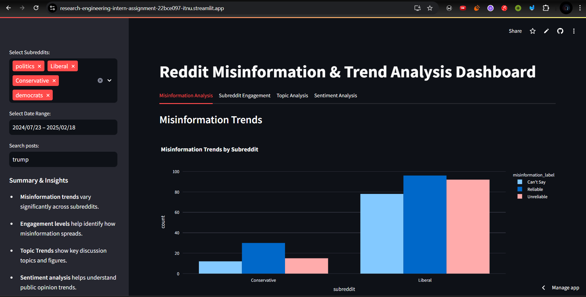
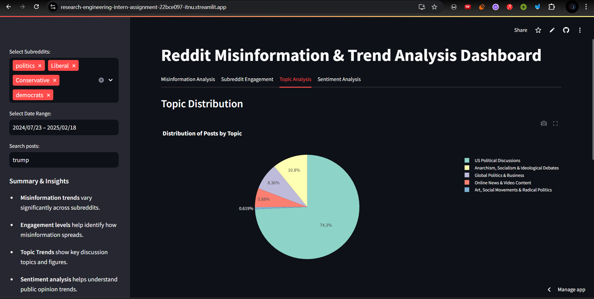
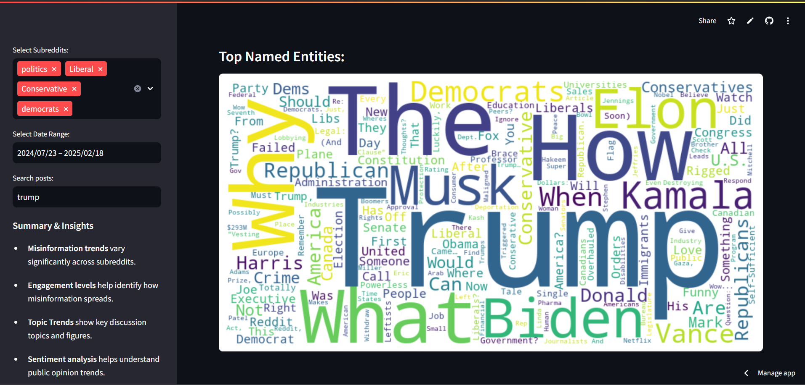
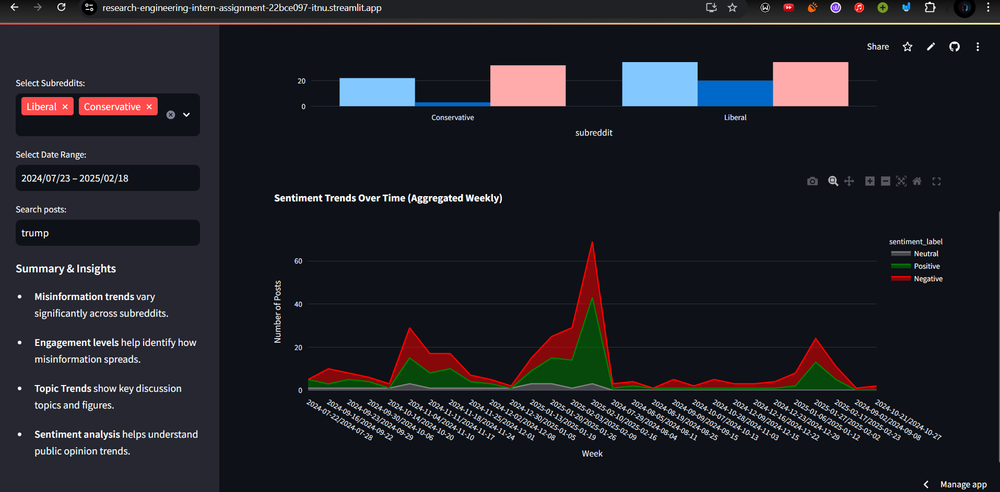

# Reddit Misinformation and Trend Analysis Dashboard

## 🚀 Live Hosted Link
**[Streamlit Cloud](https://research-engineering-intern-assignment-22bce097-itnu.streamlit.app/)**

## 📌 Project Overview
This interactive dashboard is designed to analyze and visualize misinformation trends, subreddit engagement, and topic trends on Reddit. Users can explore how different subreddits discuss various topics, identify misinformation, and analyze sentiment trends over time.

## 🔥 Features
### 🔹 Sidebar
- **Subreddit Selection** – Analyze a single subreddit or compare multiple subreddits.
- **Timeframe Selection** – Choose different time periods for trend analysis.
- **Keyword Search** – Identify trends for posts containing specific keywords.

### 🔹 Dashboard Insights
- **Misinformation Analysis** – Detect potential misinformation patterns using NLP-based techniques.
- **Subreddit Engagement** – Track post and comment activity across selected subreddits.
- **Topic Analysis** – Identify dominant discussion themes using topic modeling.
- **Sentiment Analysis & Trends** – Visualize sentiment shifts over time.

## 🛠 Tech Stack
- **Frontend:** Streamlit (for interactive UI components)
- **Backend:** Python (Pandas, NLP libraries)
- **Data Processing:** NLTK, SpaCy, LDA for topic modeling
- **Visualizations:** Matplotlib, Plotly, Wordcloud
- **Hosting:** [Streamlit Cloud](https://research-engineering-intern-assignment-22bce097-itnu.streamlit.app/)

## 📂 Project Structure
1. **`data.jsonl`** – The original raw dataset containing Reddit posts data.
2. **`simppl.ipynb`** – Jupyter Notebook for preprocessing `data.jsonl`, extracting key columns, and performing feature engineering.
3. **`final_df.csv`** – The cleaned dataset containing essential columns optimized for fast visualization.
4. **`dashboard.py`** – The main script that powers the Streamlit dashboard, visualizing all trends.

## 📸 Screenshots

## 🌐 Live Demo
Access the dashboard here: **[Streamlit Cloud](https://research-engineering-intern-assignment-22bce097-itnu.streamlit.app/)**

