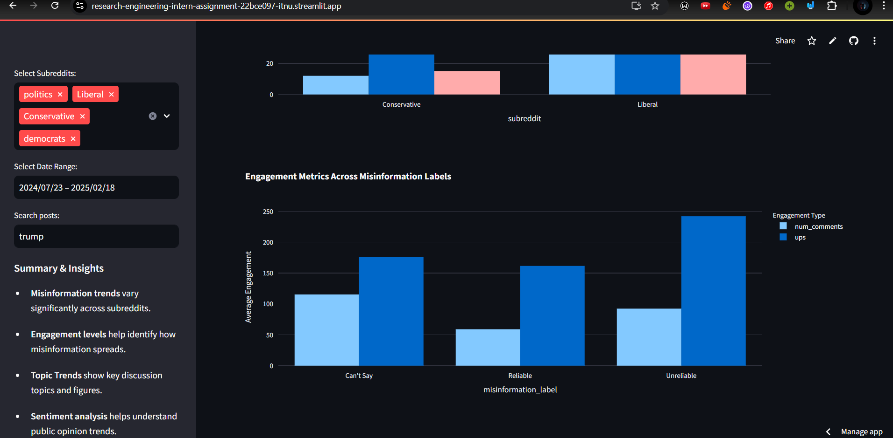
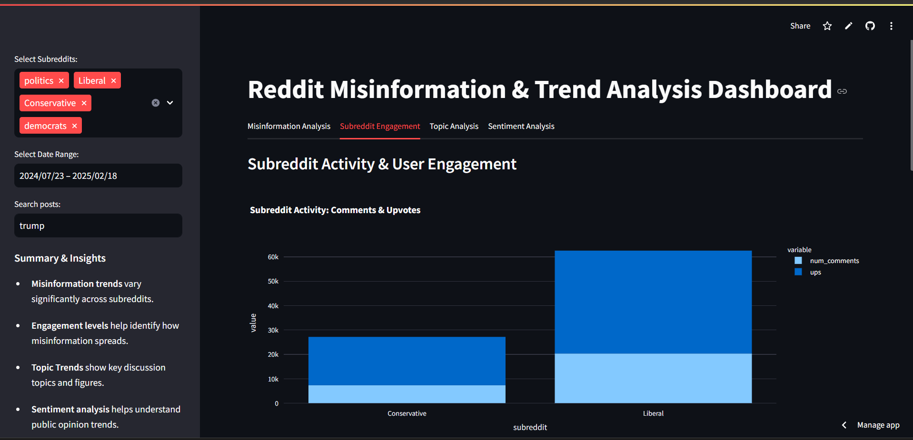
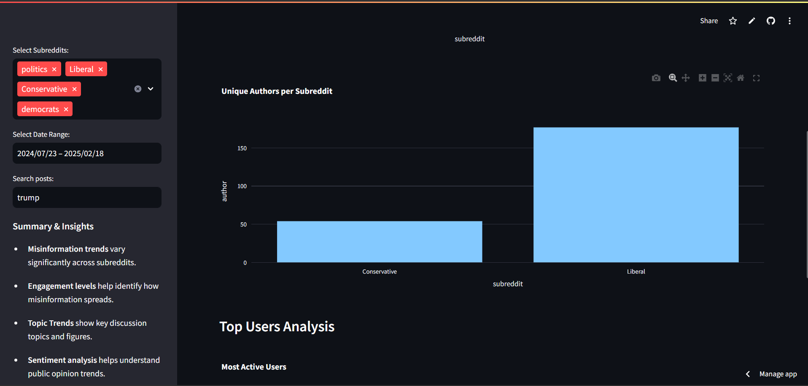
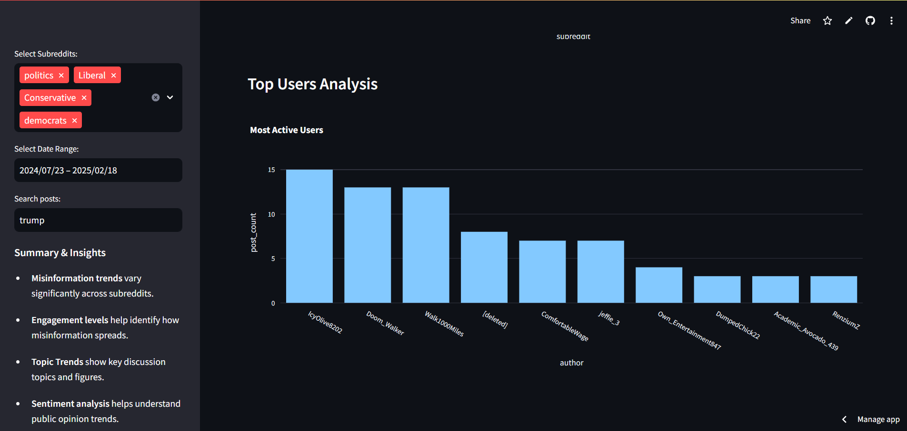
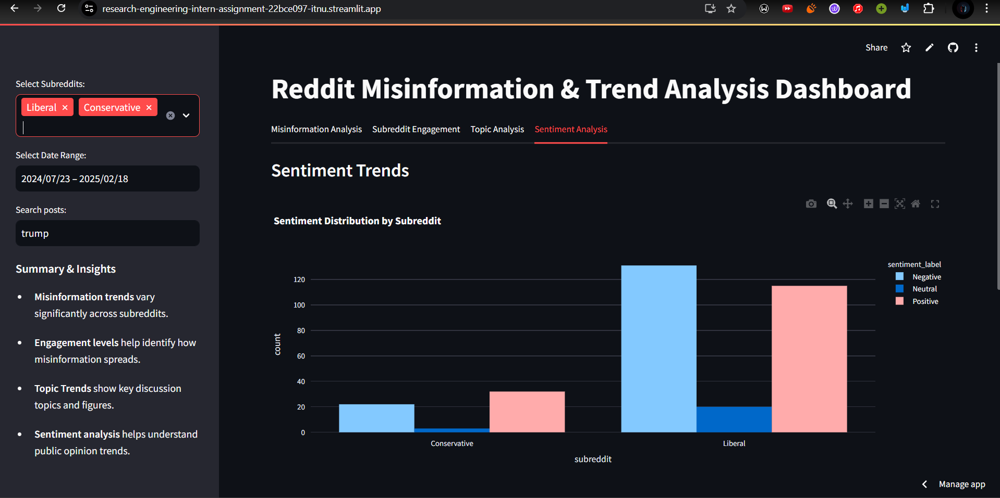

# Reddit Misinformation and Trend Analysis Dashboard

## 🚀 Live Hosted Link
**[Streamlit Cloud](https://research-engineering-intern-assignment-22bce097-itnu.streamlit.app/)**

## 📌 Project Overview
This interactive dashboard is designed to analyze and visualize misinformation trends, subreddit engagement, and topic trends on Reddit. Users can explore how different subreddits discuss various topics, identify misinformation, and analyze sentiment trends over time.

## 🔥 Features
### 🔹 Sidebar
- **Subreddit Selection** – Analyze a single subreddit or compare multiple subreddits.
- **Timeframe Selection** – Choose different time periods for trend analysis.
- **Keyword Search** – Identify trends for posts containing specific keywords.

### 🔹 Dashboard Insights by different Tabs
- **Misinformation Analysis** – Detect potential misinformation patterns using NLP-based techniques.
- **Subreddit Engagement** – Track post and comment activity and top authors across selected subreddits.
- **Topic Analysis** – Identify dominant discussion themes using topic modeling and Top Named Entities.
- **Sentiment Analysis & Trends** – Visualize sentiment shifts over time and its distribution by subreddit(s).

## 🛠 Tech Stack
- **Frontend:** Streamlit (for interactive UI components)
- **Backend:** Python (Pandas, NLP libraries)
- **Data Processing:** NLTK, SpaCy, LDA for topic modeling
- **Visualizations:** Matplotlib, Plotly, Wordcloud
- **Hosting:** [Streamlit Cloud](https://research-engineering-intern-assignment-22bce097-itnu.streamlit.app/)

## 📂 Project Structure
1. **`data.jsonl`** – The original raw dataset containing Reddit posts data.
2. **`simppl.ipynb`** – Jupyter Notebook for preprocessing `data.jsonl`, extracting key columns, and performing feature engineering.
3. **`final_df.csv`** – The cleaned dataset containing essential columns optimized for fast visualization.
4. **`dashboard.py`** – The main script that powers the Streamlit dashboard, visualizing all trends.

## 📸 Screenshots
1. Misinformation Trends Analysis by Subreddits 
2. Total Engagement (comments and upvotes) for each Misinformation Label 
3.Total Engagement (comments and upvotes) for each Subreddit 
4.Unique Authors count that participate in each Subreddit 
5. Most Active Users for the selected Subreddit(s) and timeframe 
6. Topic Distribution using LDA for the selected Subreddit(s) and timeframe 
7. Word Cloud for the Most Used Named Entities for the selected Subreddit(s) and timeframe 
8. Sentiment Distribution by Subreddits 
9. Sentiment Trends Aggregated Weekly 

## 🌐 Live Demo
Access the dashboard here: **[Streamlit Cloud](https://research-engineering-intern-assignment-22bce097-itnu.streamlit.app/)**

